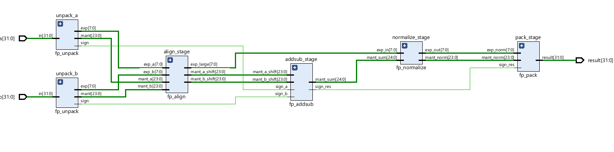

# Floating Point Adder (IEEE-754, Single Precision)

## Overview
This project implements a **32-bit IEEE-754 Floating Point Adder** in **Verilog HDL**.  
It performs addition and subtraction of floating-point numbers, covering all the key operations like exponent alignment, mantissa addition/subtraction, normalization, and packing.

Designed, simulated, and verified using **AMD Vivado**, this project can be synthesized for FPGA boards such as **Basys 3**, **Nexys A7**, or any other **Artix-7**-based device.

---

## Features
- Fully IEEE-754 compliant single-precision (32-bit) arithmetic  
- Handles **positive and negative operands**  
- Includes **normalization**  stage  
- Modular and hierarchical design for readability  
- **Testbench** included for simulation and verification  
- **Waveform results** included for visual confirmation  

---

---

## Working Principle
1. **Unpacking:** Extracts sign, exponent, and mantissa from each input operand.  
2. **Alignment:** The mantissa of the smaller exponent is right-shifted until exponents match.  
3. **Addition/Subtraction:** Mantissas are added or subtracted based on operand signs.  
4. **Normalization:** Adjusts mantissa and exponent to maintain IEEE-754 format.  
5. **Packing:** Recombines sign, exponent, and mantissa into a 32-bit floating-point result.

---

## Simulation
Run the simulation in **Vivado** or **ModelSim** to verify the results.  
You can view the waveform in the **img/** folder.

### Simulation Results
![Waveform](Img/waveform.png

