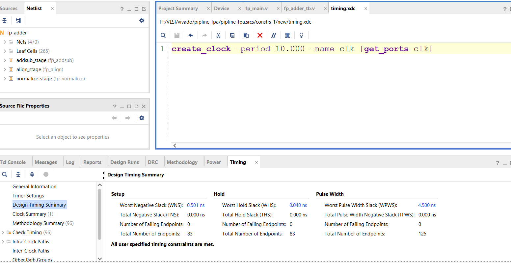
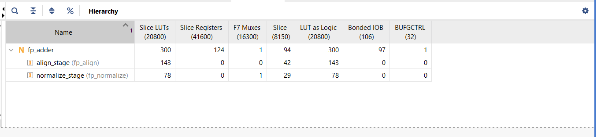
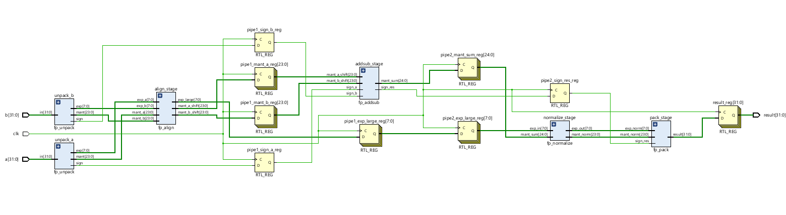
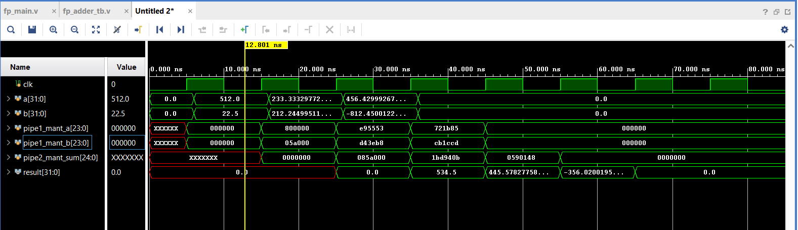

# High-Performance 32-Bit Pipelined Floating Point Adder

## Project Overview
This repository features a 32-bit Floating Point Adder (IEEE-754) implemented on a **Xilinx Artix-7 FPGA**. This project demonstrates a significant performance leap by transitioning from a single-cycle combinational design to a high-throughput **3-stage pipelined** architecture.

## Technical Specifications
* **Standard:** IEEE-754 Single Precision.
* **Operations:** Addition and Subtraction.
* **Target Device:** Artix-7 (xc7a35tcsg324-1).
* **Hardware Toolchain:** Xilinx Vivado (Synthesis, Implementation, STA).
* **Pipeline Stages:**
    1.  **Alignment Stage:** Mantissa shifting and exponent comparison.
    2.  **Add/Sub Stage:** 24-bit fixed-point addition/subtraction.
    3.  **Normalization Stage:** Leading-zero detection, shifting, and final packing.

---

## Performance Comparison
The primary goal was to resolve the timing bottleneck identified in the initial design. Through **Static Timing Analysis (STA)**, the logic depth was reduced by 75%, enabling a **348% increase in clock frequency**.

### Metric Summary Table

| Parameter | Non-Pipelined (Baseline) | Pipelined (3-Stage) | Result |
| :--- | :--- | :--- | :--- |
| **Worst-Case Path Delay** | 38.861 ns | **8.661 ns** | **4.48x Faster** |
| **Max Frequency ($F_{max}$)** | 25.73 MHz | **115.46 MHz** | **Massive Throughput Gain** |
| **Logic Levels** | 32 Levels | **8 Levels** | **75% Shorter Logic Paths** |
| **Slice LUTs** | 316 | **300** | **-5% (Area Saved)** |
| **Slice Registers** | 95 | **124** | **+30% (Pipeline Cost)** |
| **F7 Multiplexers** | 0 | **1** | **Efficient Logic Packing** |

---

## Implementation & Timing Images
This section provides visual proof of the performance gains and resource optimization achieved during implementation.

### 1. Timing Summary Comparison
| Non-Pipelined Timing (38.8ns Delay) | Pipelined Timing (0.501ns Slack) |
| :---: | :---: |
|  |  |
> **Note:** The pipelined version successfully closed timing at 100MHz with positive slack, whereas the non-pipelined version suffered from massive propagation delays.

### 2. Resource Utilization (LUTs & Registers)
| Non-Pipelined LUT Usage | Pipelined LUT Usage |
| :---: | :---: |
|  |  |
> **Comparison:** Despite the addition of 29 registers for pipelining, the total LUT count decreased from 316 to 300 due to more efficient logic mapping and the use of a dedicated F7 Multiplexer.

### 3. RTL Schematic Comparison
| Combinational Baseline Schematic | 3-Stage Pipelined Schematic |
| :---: | :---: |
|  |  |
> **Structural Change:** The schematic shows how the 32-level logic cloud was broken into three distinct stages separated by registers.

---

## Functional Verification (Simulation)
The pipelined design was verified using a comprehensive testbench. The waveform below represents the **Pipelined Version only**, highlighting the 3-cycle latency required to fill the pipe.

> **Simulation Analysis:** Inputs are processed at every clock edge. The first valid result appears after 3 clock cycles, after which the system outputs one result per cycle (fully stalled pipeline behavior).

---

## Technical Analysis: Breaking the Bottleneck
The original combinational design required the signal to traverse the entire alignment, addition, and normalization logic in a single cycle. By restructuring the Verilog into three distinct stages—**Alignment**, **Addition**, and **Normalization**—the logic was re-mapped into 8-level chunks. The use of a dedicated **F7 Multiplexer** in the pipelined normalization stage allowed for tighter logic packing, resulting in a lower LUT count.

---

## Conclusion
This project demonstrates the critical importance of pipelining in FPGA design. By trading a small amount of area (registers) for a significant reduction in logic depth, the system throughput was increased by **3.5x**, making it suitable for high-speed digital signal processing applications.
